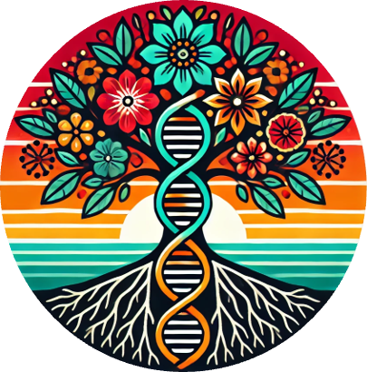

{fig-align="center" width="300"}

# Lab announcements {.unnumbered}

## In the Media

-   **Lacey Heinsberg Featured Story**
    -   [Lacey Heinsberg's Journey to Pitt -- School of Nursing](https://www.nursing.pitt.edu/news/lacey-heinsberg-journey-to-pitt){target="_blank"}
-   **Pediatric Traumatic Brain Injury Research Featured In:**
    -   [University of Pittsburgh School of Health Sciences News](https://www.health.pitt.edu/news/pitt-study-finds-signature-pediatric-brain-injury){target="_blank"}
    -   [The Conversation: Newly Discovered Link Between Traumatic Brain Injury in Children and Epigenetic Changes Could Help Personalize Treatment](https://theconversation.com/newly-discovered-link-between-traumatic-brain-injury-in-children-and-epigenetic-changes-could-help-personalize-treatment-for-recovering-kids-271453){target="_blank"}
    -   [Pittsburgh Post-Gazette: Pitt Researchers Identify Biomarker in Pediatric Brain Injury](https://www.post-gazette.com/news/health/2026/01/24/pitt-traumatic-brain-injuries-biomarker-children/stories/202601250022){target="_blank"}
    -   [WTAE Channel 4 News Feature](https://www.facebook.com/watch/?v=726495023578178){target="_blank"}

## Good news! 

-   February 2026: Congratulations to Sophia Pollex for successfully defending her BPhil project entitled "Associations between iron metabolism gene variability and outcomes after aneurysmal subarachnoid hemorrhage"!

-   December 2025: Congratulations to Lacey Heinsberg for receiving the Ruth Perkins Kuehn Nursing Research Award (\$36,878) "GROW Together: Nursing Assessment of Early Infant Metabolic Health"!

-   May 2025: Congratulations to Kaylynn Bryan upon her graduation from Pitt Nuring's BSN program! We will miss you and wish you the very best!!!

-   December 2024: Congratulations to Sophia Pollex for receiving the Reva Rubin Memorial Undergraduate Research Fund Award (\$3,828) "Associations Between Iron Metabolism Gene Variability and Clinical Outcomes After Aneurysmal Subarachnoid Hemorrhage."

-   August 2024: Congratulations to Nicky Hawley, Erin Kershaw, and Angie Bengtson and the rest of the OLAGA research group for their recent NIH/NICHD R01 award "*CREBRF* and risk of pregnancy and postpartum dysglycemia in American Samoan women"!

-   August 2024: Congratulations to Lacey Heinsberg and the rest of the OLAGA research group for their recent NIH/NICHD R00 award "*CREBRF* Genomics, Gestational Diabetes, and Early Life Body Size in American Samoa"!
